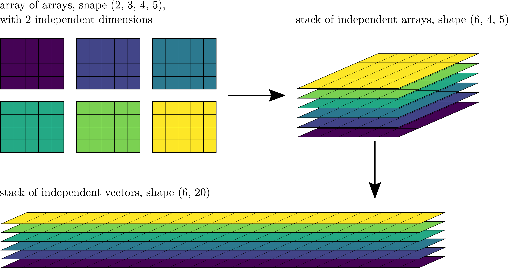

Overview
========

PyCUP objects
-------------

PyCUP performs the same array operations on multiple *independent arrays*.
These independent arrays are stored in a *container*.
The array comprising the container and its constituent independent arrays can be thought of as an *array of arrays*.
In general, the independent arrays, container, and array of arrays can have arbitrary shapes and numbers of dimensions.

For concreteness, we say that the container has :math:`M` dimensions, shape :math:`(m_0, m_1, \cdots, m_M) = \mathbf{m}`, and total number of elements :math:`\hat{m} =\prod_{i=0}^M m_i`.
Similarly, independent arrays have :math:`N` dimensions, shape :math:`(n_0, n_1, \cdots, n_N) = \mathbf{n}`, and total number of elements :math:`\hat{n} =\prod_{i=0}^N n_i`.
With this convention, the array of arrays then has :math:`P = M + N` dimensions, shape :math:`\mathbf{p} = (\mathbf{m}, \mathbf{n})`, and total number of elements :math:`\hat{p} = \hat{m} \hat{n}`.
:math:`M` is also referred to as the *number of independent dimensions* (*noid*) elsewhere in the PyCUP documentation.

Prior to performing array operations, the array of arrays is transformed into a shape more conducive to efficient memory access.
Depending on the operation type, this transformed object is either a *stack of independent arrays* of shape :math:`(\hat{m}, \mathbf{n})` in which container dimensions are flattened but individual arrays are not, or a *stack of independent vectors* of shape :math:`(\hat{m}, \hat{n})` in which container dimensions, as well as individual array dimensions are flattened.

:numref:`fig_array_views` shows an example of an array of arrays, and its corresponding stack of independent arrays and stack of independent vectors.

.. _fig_array_views:

  Clockwise from top left: example of array of arrays, stack of independent arrays, and stack of independent vectors.

Naming Convention
-----------------
The arrays used PyCUP operations have a naming convention based on their shape:

  * :math:`\mathsf{x, y, z}` :
    array of shape :math:`(\mathbf{m}, \mathbf{n})` corresponding to a container of shape :math:`\mathbf{m}` holding independent arrays of shape :math:`\mathbf{n}`

  * :math:`\mathsf{u}, \mathsf{v}` :
    array of shape :math:`\mathbf{n}` corresponding to a single independent array of shape :math:`\mathbf{n}`

  * :math:`a, b, c` :
    array of shape :math:`\mathbf{m}` corresponding to container of shape :math:`\mathbf{m}` holding independent scalars

  * :math:`d, e` :
    scalars

Subpackage Structure
--------------------
In PyCUP, each operation is structured as a separate subpackage.
The core of each of these subpackages is an ``Engine`` class, derived from :py:class:`pycup.base.Engine`, that executes the operation after verifying the validity of all arguments.
Each operation subpackage contains five modules:

  * ``__init__.py`` :
    exposes relevant classes and functions in the subpackage to the namespace

  * ``base.py`` :
    defines the operation's engine base class

  * ``npa.py`` :
    defines the operation's engine class for operation on NumPy arrays; derived from base class

  * ``pca.py`` :
    defines the operation's engine class for operation on PyCUDA arrays; derived from base class

  * ``top.py`` :
    defines convenience functions associated with the operation