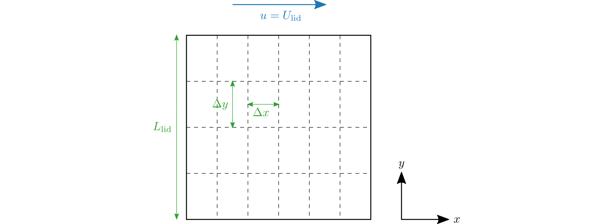

Overview
========

The lid-driven cavity (LDC) is a standard benchmark in computational fluid dynamics.
In its simplest form, this system consists of a square cavity with side lengths :math:`L_\mathrm{lid}` that has been discretized in the :math:`x` and :math:`y` dimensions with spacing :math:`\Delta x` and :math:`\Delta y` respectively, with the top of the cavity having a fixed velocity :math:`U_\mathrm{lid}`.

  Lid-driven cavity system diagram and associated parameters

LidDrivPy solves the lid-driven cavity problem by discretizing the Navier-Stokes equations with the finite-volume method and using a predictor-corrector algorithm.
The nondimensionalized incompressible Navier-Stokes equations in 2 dimensions are given by:

.. math::

  \begin{align}
    \label{eq:navier-stokes-u}
    \frac{\partial u}{\partial t} + \frac{\partial u^2}{\partial x} + \frac{\partial uv}{\partial y} &= -\frac{\partial p}{\partial x} + \frac{1}{\mathrm{Re}} \Bigg( \frac{\partial^2 u}{\partial x^2} + \frac{\partial^2 u}{\partial y^2} \Bigg) \\
    \label{eq:navier-stokes-v}
    \frac{\partial v}{\partial t} + \frac{\partial v^2}{\partial y} + \frac{\partial uv}{\partial x} &= -\frac{\partial p}{\partial y} + \frac{1}{\mathrm{Re}} \Bigg( \frac{\partial^2 v}{\partial x^2} + \frac{\partial^2 v}{\partial y^2} \Bigg) \\
    \frac{\partial u}{\partial x} + \frac{\partial v}{\partial y} &= 0,
  \end{align}

where :math:`u` and :math:`v` are the components velocity along the :math:`x` and :math:`y` dimensions respectively, :math:`p` is the pressure, and  :math:`\mathrm{Re}` is the system's Reynolds number.

LidDrivPy's algorithm has 3 steps:

1. *Predictor step* Compute the intermediate solutions to :math:`u` and :math:`v` by ignoring the contribution of the pressure gradient to the time-derivative.

2. *Corrector step* Compute the pressure field necessary to ensure the system is incompressible

3. *Correction step* Correct the intermediate solutions by subtracting the pressure gradients

For more information about the main algorithm and components of LidDrivPy, see the source code in the :py:mod:`liddrivpy.base` module, or this :download:`report <figs/project.pdf>`.